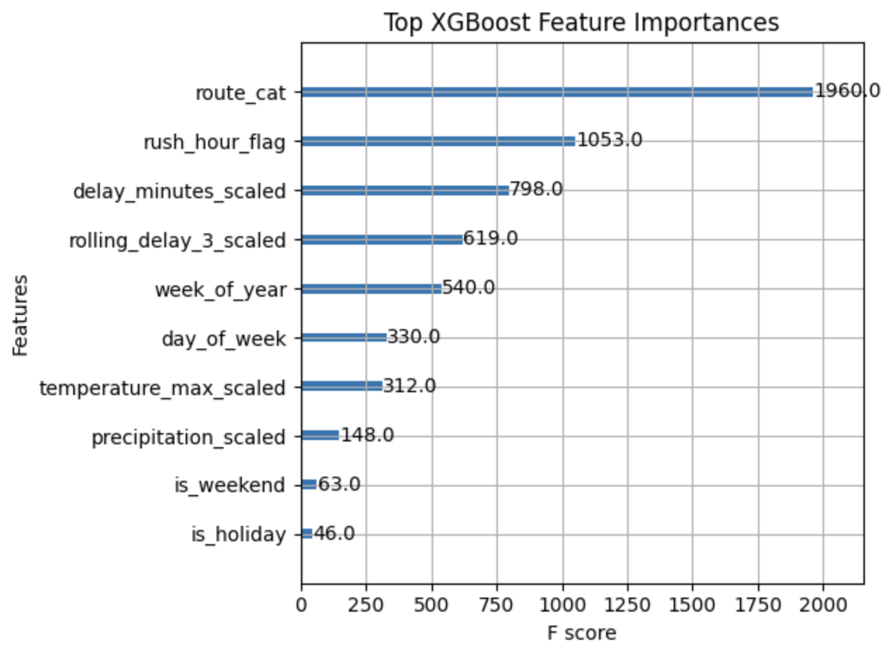
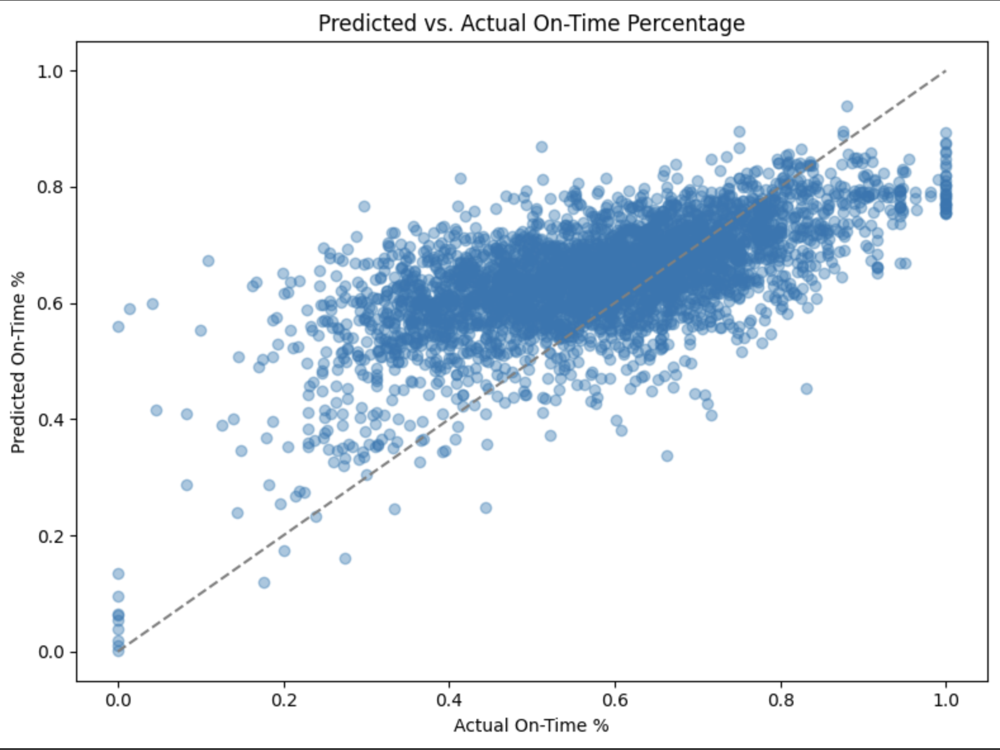
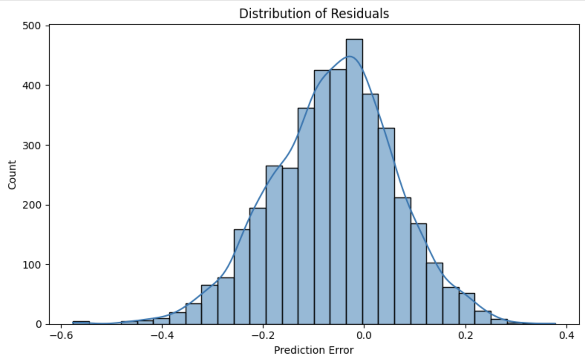

# Spark! Bus Equity Project: Final Report

### [https://youtu.be/0IoijBwagVU]

---

## Table of Contents  
- How to Build and Test the Code  
- How to Contribute  
- Supported Environment and GitHub Workfow 
- Project Overview  
- Deliverables Overview  
- Datasets  
- Data Processing 
- Exploratory Visualizations: Ridership and Delay Insights
- Data Modeling/Training and Results  
- Model Evaluation Visualizations 
- Project Files

---

## How to Build and Test the Code

To fully reproduce our project pipeline, use the provided `Makefile`:

```bash
# Install all dependencies
make setup

# Download the cleaned dataset, which includes engineered features, from Google Drive
make download_data

# Run the final XGBoost model notebook
make run_model

# (Optional) Run basic data validation tests
make test
```
---

## How to Contribute

1. Fork the repository to your own GitHub account.
2. Clone your fork locally:
   ```bash
   https://github.com/irened123/BusEquityAnalysis.git
   ```
3. Install dependencies with `make setup`, create a new branch, commit your changes, and open a pull request.

---

## Supported Environment and GitHub Workflow 

This project supports reproducible development using `requirements.txt` or `environment.yml`.  
Automated testing is configured using GitHub Actions in `.github/workflows/test.yml`.

---

## Project Overview

This project analyzes MBTA bus performance using ridership and bus arrival/departure data from 2017 to 2024.  In addition to exploring key questions—such as how ridership has recovered post-pandemic and which high-priority bus routes experience the most delays—we developed a machine learning model.

The model aims to predict each route’s daily on-time percentage in September 2024 using delay trends, weather data, and calendar-based features from January through August 2024. By understanding and forecasting these trends, transit agencies can make more informed decisions about scheduling, route planning, and equity-based service improvements. The project follows the complete data science lifecycle: data collection, cleaning, visualization, feature engineering, model training, and reproducibility.

---

## Deliverables Overview

Our final deliverables include:

- Preprocessed and visualized ridership and delay trends  
- A feature-engineered dataset incorporating weather conditions and calendar context  
- An XGBoost regression model that predicts daily on-time performance per route for September 2024  
  (Additional modeling experiments include Random Forest Regressor, Linear Regression, and Dummy Regressor baselines)  
- A reproducible pipeline including a Makefile, test suite, and SHAP-based model interpretability tools  

---

## Datasets

**Ridership Dataset:**

- [Monthly Ridership by Mode and Line (2018–2024)](https://mbta-massdot.opendata.arcgis.com/datasets/MassDOT::mbta-monthly-ridership-by-mode-and-line/explore)  
- [Monthly Ridership by Mode Archive (2017–2018)](https://mbta-massdot.opendata.arcgis.com/datasets/MassDOT::mbta-monthly-ridership-by-mode-archive/explore)  
- Note: The Silver Line is classified as a bus rapid transit (BRT) service and is included under "bus" in MBTA datasets.

**Arrival/Departure Dataset:**

- [MBTA Bus Arrival Departure Times 2024](https://mbta-massdot.opendata.arcgis.com/datasets/96c77138c3144906bce93d0257531b6a/about)

---

## Data Processing 

**Ridership Dataset:**

- Combined and cleaned historical ridership data from 2017–2024  
- Aligned schemas and standardized datetime formats  
- Filtered by `daytype == 'Total'` for accurate monthly comparisons  
- Produced: `cleaned_data/combined_bus_silverline_2017_2024.csv`  

**Arrival/Departure Dataset:**

- Merged monthly CSVs from January 2024  
- Parsed scheduled and actual times, and computed delays  
- Created `delay_minutes`, `on_time_flag`, and derived travel time metrics  
- Aggregated data to daily, route-level averages for initial exploration  

**Machine Learning Model Input (Expanded Arrival/Departure Dataset):**

- Extended the Arrival/Departure dataset for model training by incorporating feature engineering  
- Cleaned and merged delay records from January–August 2024 with weather and calendar-based attributes (e.g., holidays, weekends)  
- Computed additional features including 3-day rolling averages of delay, and rush hour indicators based on scheduled time  
- Aggregated data into daily route-level summaries used to train the ML model  

---

## Exploratory Visualizations: Ridership and Delay Insights

### A. Ridership Analysis (`notebooks/data_analysis_preparation/analyze_ridership_change.ipynb`)

- **Annual Totals (2017–2024):** COVID impact and post-2023 recovery  
- **Pre- vs. Post-Pandemic Comparison:** Silver Line recovered more strongly  
- **Monthly Trends:** Seasonal variation with gradual post-pandemic growth  

*Example Visual:*  


---

### B. Delay and Travel Time Analysis (`notebooks/data_analysis_preparation/arrival_departure_data_processing.ipynb`)

- **Citywide average delay:** ~0.76 minutes early  
- **Target routes (e.g. 22, 29):** ~1.19 minutes early  
- **Top delayed routes:** >45% of trips over 5 minutes late  

Visualizations include histograms, route comparisons, and average travel times  

*Example Visual:*  


---

### Data Modeling/Training and Results

To predict each route's daily on-time percentage, we implemented a full supervised learning pipeline in `notebooks/modeling/on_time_xgboost_final.ipynb`. Our approach combined delay, weather, and calendar features into a structured time series modeling task.

- **Feature Engineering:**  
  We created daily, route-level features designed to reflect both recent performance and contextual conditions:
  - `delay_minutes`: average route-level delay in minutes  
  - `rolling_delay_3`: 3-day rolling average of delay to capture short-term trends  
  - `route_cat`: encoded categorical route identifier  
  - `day_of_week`, `week_of_year`: to capture seasonal and weekday patterns  
  - `temperature_max`, `precipitation`: scaled numerical weather data  
  - `is_raining`, `is_holiday`, `is_weekend`: binary indicators of context  
  - `rush_hour_flag`: binary indicator for trips scheduled during peak commute hours (7–9AM, 4–6PM)

- **Model Selection & Training:**  
  We selected `XGBoostRegressor` for its ability to handle non-linear relationships and work well with tabular data. Training data spanned January–August 2024, with September 2024 held out as a realistic forecasting target. We used `GridSearchCV` with 3-fold CV to tune hyperparameters: `n_estimators`, `learning_rate`, `max_depth`, `subsample`, `colsample_bytree`.

- **Modeling Assumptions:**  
  - Past short-term delays are predictive of future performance.  
  - Weather and calendar features affect delays in systematic ways.  
  - A time-based holdout better reflects a real-world deployment setting than random shuffling.

- **Baseline Models:**  
  For context, we trained two baseline models using the same feature set:
  - **Linear Regression:** Assumes a simple linear relationship between inputs and on-time performance  
  - **Dummy Regressor:** Predicts the mean training value regardless of input

- **Evaluation & Performance:**  
  Evaluation was performed using MAE, RMSE, and R² on the September 2024 test set.  
  We also used `TimeSeriesSplit` cross-validation to assess generalization across time.

  **XGBoost Final Model Performance:**
  - MAE: **0.1065**
  - RMSE: **0.1361**
  - R²: **0.2654**
  - TimeSeries CV R²: **0.2918** (5 splits)

  **Baseline Comparison:**
  - **Linear Regression:**  
    - MAE: 0.1342  
    - RMSE: 0.1705  
    - R²: –0.1851  
  - **Dummy Regressor (mean-only predictor):**  
    - R²: –0.1126  

  These results indicate that the XGBoost model captures meaningful patterns in the data and significantly outperforms both a linear model and a naive baseline, especially in terms of R² and prediction error.


- **Interpretability:**  
  We used SHAP (SHapley Additive exPlanations) to understand the relative influence of each feature. Important drivers of on-time performance included `delay_minutes`, `rolling_delay_3`, `route_cat`, `precipitation`, and `day_of_week`. These align with our expectations about weather and temporal patterns influencing bus delays.


---

### Model Evaluation Visualizations



This plot shows the most influential features based on XGBoost's internal F-score metric.  
`route_cat`, `rush_hour_flag`, and recent delay metrics were the strongest predictors of on-time performance.



Most predictions follow the expected trend, but the model tends to underestimate performance at the very high end (e.g., near 1.0). Still, this scatterplot indicates strong correlation between predicted and actual values.



The residuals are roughly normally distributed around 0, suggesting the model is generally unbiased, though slightly overconfident on some outliers.

---

## Project Files

- `notebooks/modeling/on_time_xgboost_final.ipynb`  
  Final machine learning notebook containing feature engineering, model training, evaluation, and SHAP interpretation.

- `notebooks/data_analysis_preparation/arrival_departure_data_processing.ipynb`  
  Processes January 2024 MBTA arrival/departure data, computes delays, creates exploratory visualizations, and creates aggregated metrics for modeling.

- `notebooks/ridership/analyze_ridership_change.ipynb`  
  Explores ridership trends from 2017–2024 and generates visualizations comparing Bus vs. Silver Line recovery.

- `cleaned_data/`  
  Contains cleaned and merged datasets used in all notebooks (e.g., `combined_bus_silverline_2017_2024.csv`).

- `visuals/`  
  Directory of plots used and generated, including model evaluation visuals and exploratory figures.

- `tests/test_basic.py`  
  Basic test file to validate the presence and structure of the cleaned dataset.

- `Makefile`  
  Automates environment setup, data download, model execution, and testing using simple CLI commands.

- `requirements.txt` and `environment.yml`  
  Dependency files for setting up the Python environment via `pip` or `conda`.

- `.github/workflows/test.yml`  
  GitHub Actions configuration file to run automated tests on push or pull request.


