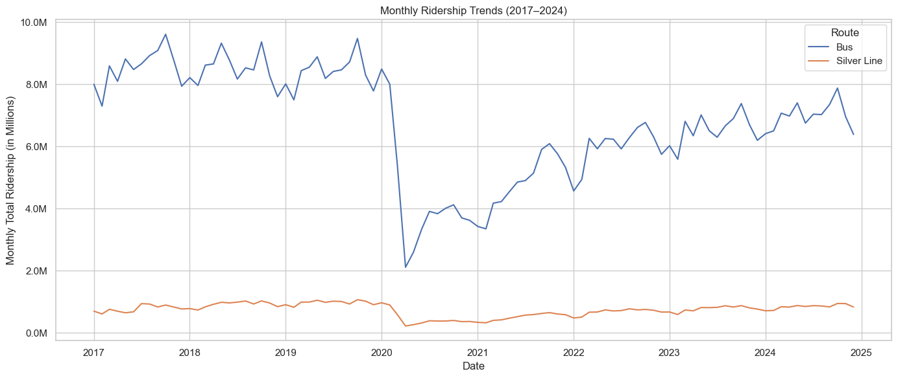

# Spark Bus Equity Project: Midterm Report

### [Insert YouTube Midterm Presentation Link Here]

---

## Table of Contents
- Deliverables Overview  
- Datasets  
- Data Preprocessing  
- Visualizations  
- Data Modeling/Training & Results  
- Future Steps  
- Project Files  

---

## Deliverables Overview

Our midterm deliverables include:
- Preprocessed and visualized ridership and delay trends  
- Data exploration of delays across target and non-target routes  
- A Random Forest regression model that predicts daily on-time performance per route for September 2024, which we plan to continue improving  

---

## Datasets

**Ridership Dataset:**
- [Monthly Ridership by Mode and Line (2018–2024)](https://mbta-massdot.opendata.arcgis.com/datasets/MassDOT::mbta-monthly-ridership-by-mode-and-line/explore)  
- [Monthly Ridership by Mode Archive (2017–2018)](https://mbta-massdot.opendata.arcgis.com/datasets/MassDOT::mbta-monthly-ridership-by-mode-archive/explore)

**Arrival/Departure Dataset:**
- [MBTA Bus Arrival Departure Times 2024](https://mbta-massdot.opendata.arcgis.com/datasets/96c77138c3144906bce93d0257531b6a/about)  
- Future work may include exploring prior years of this dataset to enable longer-term comparisons.

---

## Data Preprocessing

**Ridership Dataset:**
- Combined two separate CSVs, already cleaned in preprocess_bus_data.ipynb, (2017–2018 and 2018–2024) after aligning schemas  
- Standardized datetime formats using `pd.to_datetime`  
- Filtered by `daytype == 'Total'` to ensure full-month comparisons  
- Extracted and cleaned `year`, `date`, `route_or_line`, and ridership columns for analysis  

**Arrival/Departure Dataset:**
- Parsed multiple monthly CSVs using `glob` and merged into a single DataFrame  
- Converted scheduled/actual time strings into time objects and minutes since midnight  
- Engineered delay metrics (`delay_minutes`, `on_time_flag`)  
- Identified start and end of trips, computed actual travel times  
- Aggregated to daily averages by route and encoded route identifiers for modeling  

---

## Visualizations

### A. Ridership Analysis  
Visualizations help answer:  
- What is the ridership per bus route?  
- How has this changed from pre-pandemic to post-pandemic?

Generated using `matplotlib`, `seaborn`, and groupby aggregations.

#### Key Visuals:

**1. Annual Ridership Totals (Bus vs. Silver Line)**
- Drop in ridership during COVID-19 years  
- Recovery beginning in 2023–2024  

**2. Percent Change (Pre vs Post Pandemic)**
- Compared 2017–2019 with 2023–2024  
- Bus ridership lags behind Silver Line in recovery  

**3. Monthly Ridership Trends**
- Seasonal variation and longer-term recovery patterns  

_Example Visual:_  
  

---

### B. Delay and Travel Time Analysis  
Visualizations help answer:
- What are the end-to-end travel times for each route?  
- What is the average delay citywide?  
- Are target routes more delayed?  
- Which routes are late most often?

#### Key Findings:
- Citywide average delay: ~4.29 minutes  
- Target routes (e.g., 22, 29, 15, etc.) average delay: ~5.74 minutes  
- Top delayed routes have >40% of trips arriving over 5 minutes late  

_Example Visual:_  

---

## Data Modeling/Training & Results

### Goal  
Predict each bus route's daily on-time percentage for September 2024 using historical delay data from January through August 2024.

### Features Used
- `route_cat`: Encoded route identifier  
- `day_of_week`: Day of the week (0 = Monday, ..., 6 = Sunday)  
- `delay_minutes`: Average delay for the route on a given day  

### Model Pipeline
- Aggregated daily route-level data with engineered features  
- Trained a `RandomForestRegressor` with 100 estimators and fixed random seed  
- Performed two evaluations: one using a random split, and one using a time-based split (Jan–Aug 2024 to predict Sept 2024)

### Results

**Evaluation 1 (Random Split for Demo):**
- RMSE: **0.111**
- R²: **0.565**

**Evaluation 2 (Realistic Time-Based - Sept 2024 Prediction):**
- RMSE: **0.132**
- R²: **0.307**

The **time-based RMSE of 0.132** means that our model’s daily prediction is typically within ~13.2% of the actual on-time percentage. While R² is lower here, that’s expected due to the more realistic setting and potential non-linear delay behavior.

We plan to ontinue refining the model by adding additional features, optimizing hyperparameters, improving robustness, and experimenting with different model types.

---

## Future Steps

- Engineer new features (e.g., weather, time of day, event markers)  
- Expand the dataset to include multiple years and possibly predicting on additional months  
- Experiment with other models such as XGBoost or Gradient Boosting  
- Perform hyperparameter tuning and error analysis  
- Evaluate with additional metrics beyond RMSE (e.g., MAE, MAPE, classification accuracy if reframed)  

---

## Project Files

- `on_time_prediction.ipynb`: Machine learning modeling and evaluation  
- `merge_mbta.ipynb`: Delay dataset preprocessing, ML pipeline, and exploratory visuals, some code also found in `on_time_prediction.ipynb` 
- `analyze_ridership_change.ipynb`: Ridership dataset visualization + some preprocessing
- `cleaned_data/combine_cleaned_bus_data.ipynb`: Main preprocessing for ridership dataset 
- `cleaned_data/`: Includes preprocessed CSVs  
- `visuals/`: Contains plots and figures referenced in this report  
- `tables/`: Supplementary summary tables  
- `README.md`: This midterm report  

