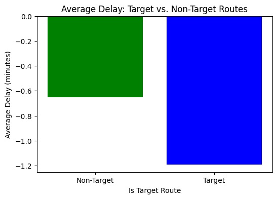

# Spark! Bus Equity Project: Final Report

### [https://youtu.be/your-final-video-link]

---

## Table of Contents  
- Makefile Instructions  
- Deliverables Overview  
- Datasets  
- Data Preprocessing  
- Visualizations  
- Data Modeling/Training & Results  
- Testing & Reproducibility  
- Future Steps  
- Project Files  

---

## Using the Makefile

```bash
# one-time environment setup
make setup

# download 6 GB cleaned dataset
make download_data

# run model notebook alone
make run_model

# run tests
make test

## Deliverables Overview

Our final deliverables include:

- Preprocessed and visualized ridership and delay trends  
- Feature-engineered dataset including weather and calendar context  
- An XGBoost regression model that predicts daily on-time performance per route for September 2024  
- Reproducible Makefile, test suite, and SHAP interpretability tools  

---

## Datasets

**Ridership Dataset:**

- [Monthly Ridership by Mode and Line (2018–2024)](https://mbta-massdot.opendata.arcgis.com/datasets/MassDOT::mbta-monthly-ridership-by-mode-and-line/explore)  
- [Monthly Ridership by Mode Archive (2017–2018)](https://mbta-massdot.opendata.arcgis.com/datasets/MassDOT::mbta-monthly-ridership-by-mode-archive/explore)  
- *Note: Silver Line is a BRT system included in the bus ridership category.*

**Arrival/Departure Dataset:**

- [MBTA Bus Arrival Departure Times 2024](https://mbta-massdot.opendata.arcgis.com/datasets/96c77138c3144906bce93d0257531b6a/about)

---

## Data Preprocessing

**Ridership Dataset:**

- Combined and cleaned historical data from 2017–2024  
- Aligned schemas and standardized datetime formats  
- Filtered by `daytype == 'Total'` for accurate monthly comparisons  
- Produced: `combined_bus_silverline_2017_2024.csv`  

**Arrival/Departure Dataset:**

- Merged monthly CSVs from January 2024  
- Parsed actual/scheduled times and computed delays  
- Created `delay_minutes`, `on_time_flag`, and derived travel time metrics  
- Aggregated to daily average values per route  

---

## Visualizations

### A. Ridership Analysis (`analyze_ridership_change.ipynb`)

- **Annual Totals (2017–2024):** COVID impact and post-2023 recovery  
- **Pre- vs. Post-Pandemic Comparison:** Silver Line recovered more strongly  
- **Monthly Trends:** Seasonal variation with gradual post-pandemic growth  

*Example Visual:*  


---

### B. Delay and Travel Time Analysis (`merge_mbta.ipynb`)

- **Citywide average delay:** ~0.76 minutes early  
- **Target routes (e.g. 22, 29):** ~1.19 minutes early  
- **Top delayed routes:** >45% of trips over 5 minutes late  

Visualizations include histograms, route comparisons, and average travel times  

*Example Visual:*  


---

## Data Modeling/Training & Results

### Goal

Predict the **on-time percentage** (defined as % of trips ≤5 min late) for each MBTA bus route per day in **September 2024**.

---

### Final Model

📄 `on_time_xgboost_final.ipynb`  
Model: `XGBoostRegressor`

**Features Used:**
- `route_cat`, `day_of_week`, `week_of_year`  
- `delay_minutes_scaled`, `rolling_delay_3_scaled`  
- `temperature_max_scaled`, `precipitation_scaled`  
- `is_raining`, `is_holiday`, `is_weekend`, `rush_hour_flag`

---

### Evaluation Results (Time-Based Split)

**XGBoost Final Model:**
- **MAE:** 0.1065  
- **RMSE:** 0.1361  
- **R²:** 0.2654  
- **TimeSeries CV Avg R²:** 0.2918

**Baselines:**
- **Linear Regression R²:** –0.1851  
- **Dummy Regressor R²:** –0.1126  

---

### SHAP Interpretability

Most influential features:
- `delay_minutes`  
- `rolling_delay_3`  
- `route_cat`  
- `precipitation`  
- `day_of_week`  

---

## Testing & Reproducibility

Tests are provided in `tests/test_basic.py`. These verify:

- ✅ The cleaned dataset exists in the correct location  
- ✅ The dataset contains the expected columns

Run tests via:

```bash
make test


